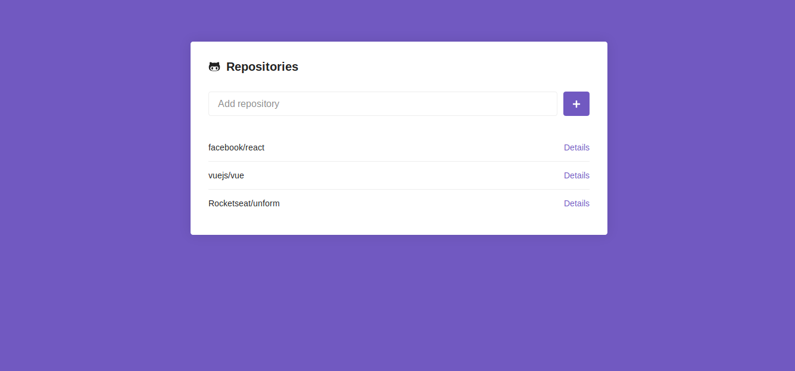
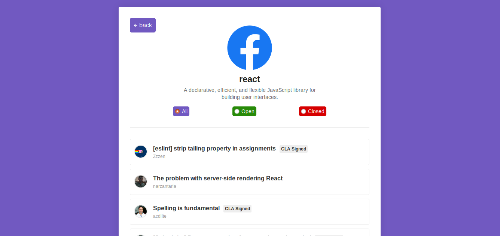

# Github repositories manager


<div style="display: flex;">
  <a href="http://artenesbok.com/rocketseat-bootcamp-module05/" style="margin-right: 10px;">
    
  </a>
  <a href="http://artenesbok.com/rocketseat-bootcamp-module05/">
    
  </a>
</div>

[Rocketseat's GoStack bootcamp](https://rocketseat.com.br/bootcamp) introductory module to ReactJS. [See it live here](http://artenesbok.com/rocketseat-bootcamp-module05/).

# About

A ReactJS app that uses `localStorage` to manage a list of your favorite github repositories.

After inserting a repository, you can see its details and browse its issues.

The project heavely uses [styled components](https://www.styled-components.com/) to style the application's layout.

# Set up

1. Clone the repository
```sh
git clone git@github.com:Artenes/rocketseat-bootcamp-module05.git
cd rocketseat-bootcamp-module05
```

2. Install dependencies
```sh
yarn
```

3. Run the app
```sh
yarn dev
```

4. Access [http://localhost:8080](http://localhost:8080).

# Contact

Artenes Nogueira - [artenes.nogueira@gmail.com](mailto:artenes.nogueira@gmail.com)

Linkedin - [linkedin.com/in/artenes/](https://www.linkedin.com/in/artenes/)

Blog - [artenesbok.com/](http://artenesbok.com/)
